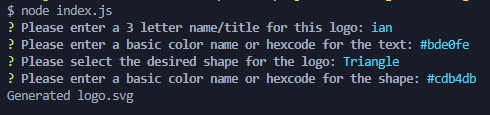
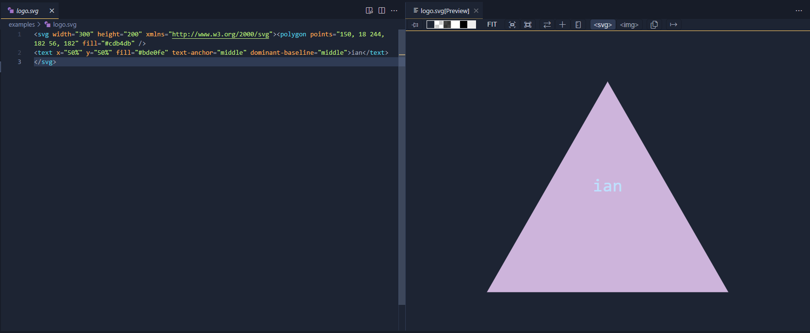

# c10-Logo-Generator

## Description
  
This application is intended to quickly and easily generate a basic SVG logo.
  
## Table of Contents (Optional)
  
 - [Installation](#installation)
 - [Usage](#usage)
 - [Credits](#credits)
 - [Features](#features)
 - [Questions](#questions)
  
## Installation
  
No installation needed!
  
## Usage
  
To use this application, clone/branch the repo, run node on index.js, then respond to the prompts as they appear. Once finished, the application generates an SVG logo based on your responses to the questions. The logo.svg will be stored in the lib folder.

Example of prompts:

Example of the logo:

Or you can [watch a brief video demonstration](https://drive.google.com/file/d/1jAQqY_txcV-Hjd3junj1FgI_FnK9vVGE/view)
  
## Credits
  
Shouts out to inquirer, jest, and everyone on stackoverflow, you the realest!

And me, Ian Wolfe
  
## Features
  
This project features inquirer to prompt the user for input, and jest to test some basic functionality.

## Questions

For any questions about this project, please visit my [GitHub](https://github.com/enkw).
